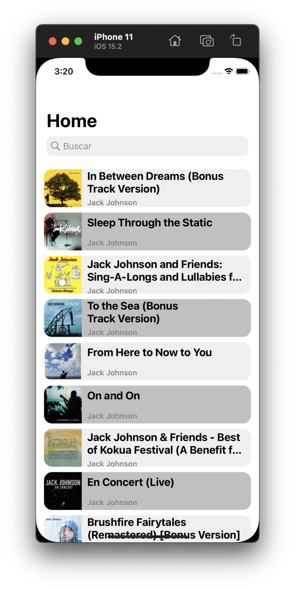
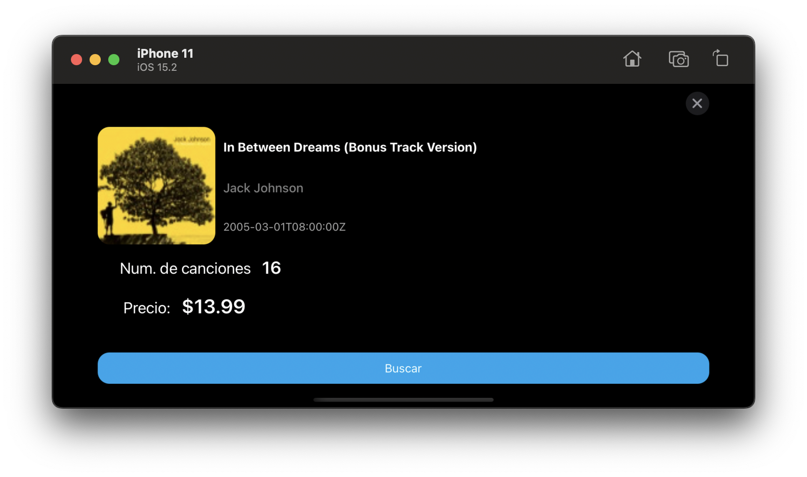

# iOS Code Challenge - Tango

Architecture: Clean Architecture (Presentation Layer - Data Layer - Domain Layer) with MVVM

Using the iTunes Search API, generate a project that presents the albums list of a determined artist.

### Required
- [x] Need to provide the full Xcode project with all the required files so can be opened and executed as is
- [x] The project must be developed using the latest version of Swift
- [x] The project must be configured so can run on any Phone size
- [x] You can use a TableView or a CollectionView to display the albums
- [x] Each cell should display at least Album and Artist name
- [x] Should display 20 allbums for the artist you prefer
- [x] Selecting an album present a modal where the next details are showed:
		- Artist Name
		- Album Name
		- Album artwork
		- Track Count
- [x] The modal can be dismissed with a gesture and a Close button

### Optional
- [x] Upload the proyect on GitHub/Bitbucket repository
- [x] The project is configured so can run on any Phone or Tablet
- [x] If using TableView, alternate cells color like displayed on the image 1
- [ ] Allow the user to query for any Artist adding a search field at the top of the TableView
- [x] The application should use Light/Dark mode
- [x] Localize the App so it uses English and Spanish
- [x] Each cell display the Album artwork
- [x] The modal showed when selecting an album display the additional details:
   - Release Date on long local format
	- Price
	- A button that can opent the album entry on Apple Music (directly on Safari or default browser)

### Screen Shoots

#### Pantallas principales (Teléfono)

  

#### Pantallas principales (Tablet)

  

